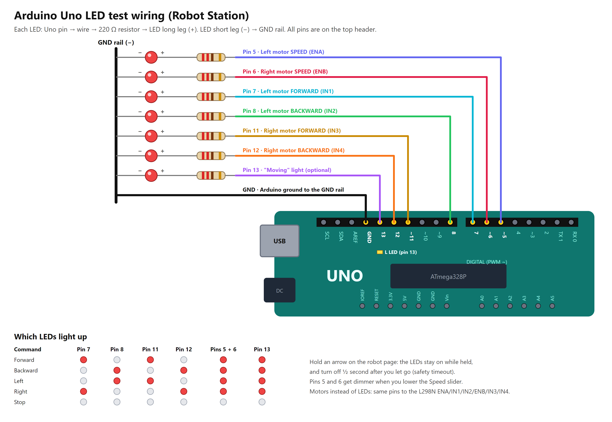

# Robot Telepresence

Two web apps that pair by serial number, over the internet:

| App | Opened on | Does |
|---|---|---|
| **Robot Station** (`robot.html`) | Robot laptop, Chrome or Edge | Streams the webcam and microphone, shows the user's camera or shared screen with their voice, goes online under a serial number, drives the Arduino Uno over USB, shows the invite link |
| **Robot Control** (`user.html`) | Anyone's browser, from the invite link | Watch and hear the robot full screen, talk back with camera and microphone, share the screen, drive with the D-pad or keyboard |

Both pages are hosted for free on **GitHub Pages**. The robot and the user can be anywhere, on any network.

```
 Driver's browser        GitHub Pages (hosts both pages)        Robot laptop's browser     Arduino Uno
 ┌──────────────┐                                              ┌──────────────────┐  USB  ┌────────┐
 │ user.html    │   ┌────────────────────────────────────┐     │ robot.html       │ ────▶ │ motors │
 │ ?serial=RB-… │──▶│ Matchmaking (PeerJS): finds robot  │◀────│ webcam           │       └────────┘
 │              │   └────────────────────────────────────┘     │                  │
 │              │ ◀═════ robot's video + sound ═════════════════│                  │
 │              │ ══════ user's video/screen + sound ══════════▶│                  │
 │  D-pad       │ ═══════════ commands ════════════════════════▶│                  │
 └──────────────┘   direct, or through the Metered relay        └──────────────────┘
                    (TURN) when the networks can't connect directly
```

## One-time setup (about 15 minutes)

You need: this folder on the robot laptop, [Node.js](https://nodejs.org) and [Git for Windows](https://git-scm.com/download/win). These are only needed to publish; nobody needs them to use the apps.

**1. GitHub account and repository**
1. Create a free account at https://github.com/signup.
2. Create a repository at https://github.com/new: name it `robot-telepresence`, choose **Public**, and **don't** tick "Add a README". Press **Create repository**.

**2. Relay account (Metered, free tier)**
1. Sign up at https://www.metered.ca/stun-turn.
2. In the dashboard, open **TURN Server** and create a credential if none exists.
3. Copy the **API URL** that returns the ICE servers. It looks like
   `https://YOUR-APP.metered.live/api/v1/turn/credentials?apiKey=XXXX`

**3. Publish**
1. Double-click **`deploy-github.bat`**.
2. Type your GitHub username, press Enter to accept the repository name, and paste the Metered URL.
3. If a GitHub sign-in window opens, sign in. The window ends with **Published** and your robot page address.

**4. Turn the site on (first time only)**
1. Open `https://github.com/YOUR-NAME/robot-telepresence/settings/pages`.
2. Under **Build and deployment**, set Source to **Deploy from a branch**, Branch to **gh-pages** and **/ (root)**, and press **Save**.
3. Wait about a minute.

## Every day

**Robot laptop**
1. In Chrome or Edge, open `https://YOUR-NAME.github.io/robot-telepresence/robot.html` and bookmark it.
2. Press **Start camera** (allow the camera and microphone), then **Go online**. The status turns green: `Online · RB-XXXXXX`.
3. Plug in the Arduino Uno and press **Connect Arduino** (the first time, pick the Uno in the list). After that it connects by itself whenever the page opens or the Uno is plugged in.
4. Press **Copy link** in the **Invite link** box and send the link (WhatsApp, email...).
5. Optional: press **Full screen** on the video so the robot's screen shows the user's face.

The link stays the same as long as the serial number does, so a user can keep it and reuse it.

**User**
Open the link and allow the camera and microphone. It connects straight to the robot, with nothing to install, in any modern browser, on any network. Hold an arrow to drive; releasing it stops. Keyboard: arrows or WASD, Space to stop.

## Sound, video and screen sharing

- **Both ways:** the user sees and hears the robot; the robot's screen shows the user's camera (full size, with the robot's own camera as a small preview in the corner) and plays their voice. Either side can go without a camera or microphone; the call still works with whatever is available.
- **Buttons at the bottom left of the user screen:** hang up, mute microphone, camera off, **share screen**, full screen.
- **Screen sharing** (computers only, not phones): pick a screen, window or tab. The robot's display switches to it, labelled *User's screen*, and switches back to the camera when you press the button again or the browser's *Stop sharing*.
- **Robot microphone:** people near the robot can press **Mute microphone** for privacy. The user sees *Robot mic off*.
- **No sound?** If the browser blocks sound until the page is clicked, a *Click to hear…* button appears; press it once. Use headphones on the user side if there is echo.

**After changing anything** in `public/` (for example `config.js`), double-click `deploy-github.bat` again. It remembers your answers.

## Without GitHub (local mode)

`start-robot.bat` runs the robot page from the laptop itself (`http://localhost:3000/robot`). Without a published site, it tries to create a temporary public link through a Cloudflare quick tunnel. That link changes every restart and doesn't work on networks that block outbound port 7844, which includes many phone hotspots. `start-user.bat` runs the user page locally.

## The connection stays up until you end it

- **User side:** only the red hang-up button ends the session. If the link drops (Wi-Fi blip, network change, robot page reloaded), the screen shows *Reconnecting…* and retries until the link is back.
- **Robot side:** it stays online until you press **Go offline**. If the matchmaking server drops, it reconnects by itself. If the robot page reloads or the browser restarts while online, it turns the camera back on and goes online again automatically.
- **Keep-alive:** both sides ping each other every second, so a dead link is noticed within 6 seconds. Both laptops' screens are also kept awake while the apps are open.
- **Motors stop whenever the link is down**, and resume on the next command after reconnecting.

## Relay (TURN) server

The laptops first try to connect **directly**, which works on most home and office networks. On phone hotspots, 4G/5G and strict firewalls, the video goes through the **Metered relay** instead. The robot page shows **Relay (TURN): Configured** when it's set up, and the user's top bar shows **Via relay** when it's in use.

- Relayed video uses roughly 0.5–1 GB per hour. Check the free allowance in your Metered dashboard.
- The relay URL is saved in `public/config.js` (`turnCredentialsUrl`). Any other TURN provider works too: list it under `turnServers`.
- To check the relay works, set `relayOnly: true` temporarily and republish.

## Status indicators (user screen, top right)

| Indicator | Meaning |
|---|---|
| `Direct` / `Via relay` | Video goes straight between the laptops, or through the TURN relay |
| `Arduino connected` / `Simulation` | Whether the robot has its Arduino Uno attached |
| `Robot mic off` | Someone at the robot muted its microphone |
| `45 ms` | Round-trip time for commands |

## Arduino Uno

The robot page drives the motors through an **Arduino Uno** on the robot laptop's USB port.

**Upload the sketch (once)**
1. Plug the Uno into the laptop. Windows shows it as *Arduino Uno (COMx)*, or *USB-SERIAL CH340 (COMx)* for most clones.
2. In the Arduino IDE, open `arduino/robot_controller_uno/robot_controller_uno.ino`, choose board **Arduino Uno** and the Uno's COM port, and press **Upload**.

**Connect it to the robot page:** press **Connect Arduino** and pick the Uno. The page restarts the Uno and turns green (*Arduino connected*) about a second later. From then on it connects by itself when the page opens or the Uno is plugged in.

**Wiring** (L298N or similar dual H-bridge driver; remove its ENA/ENB jumpers so speed control works):

| L298N | Uno pin | Test LED meaning |
|---|---|---|
| ENA | 5 (PWM) | Left motor speed |
| IN1 | 7 | Left forward |
| IN2 | 8 | Left backward |
| ENB | 6 (PWM) | Right motor speed |
| IN3 | 11 | Right forward |
| IN4 | 12 | Right backward |
| GND | GND | Ground, shared with the driver |



With no motors, the Uno's **L** LED (pin 13) lights while a move command is active. To test with LEDs instead of motors: pin → 220 Ω resistor → LED long leg; LED short leg → GND.

**Serial protocol** (115200 baud, one command per line): `F 200` forward, `B 200` backward, `L 200` spin left, `R 200` spin right (speed 0 to 255), `S` stop. `?` makes it reply `READY robot_controller`; the robot page uses it to check the sketch is running. The Uno replies `OK <cmd>` when the command changes, and it stops by itself if no command arrives for 500 ms.

**If the robot page can't reach the Uno:**

| What you see | Cause and fix |
|---|---|
| *No Arduino found* | The Uno isn't reaching the laptop. Use a USB cable that carries data (for a genuine Uno, the square "printer" USB-B cable); the green **ON** light must be lit; try another USB port. Clone boards need the [CH340 driver](https://www.wch-ic.com/downloads/CH341SER_EXE.html). |
| *Arduino not answering* | The robot sketch isn't on the Uno. Upload `robot_controller_uno.ino` as above. |
| *Arduino port busy* | Another program has the Uno's port: the Arduino IDE (Serial Monitor or an upload) or another Robot Station tab. Close it and press **Connect Arduino**. |
| The Arduino IDE can't upload: port busy | The robot page has the port. Press **Disconnect Arduino** (or close the robot page) while uploading. |

## ESP32 (alternative board)

`esp32/robot_controller/robot_controller.ino` is the same controller for an ESP32 (pins listed at the top of the file). The robot page accepts it too, as long as its USB chip is a CP210x or CH340. Installing the ESP32 boards in the Arduino IDE needs `downloads.arduino.cc`, which is blocked from some connections; use a VPN for that install.

## Files

```
start-robot.bat                    local mode: run the robot page from this laptop
start-user.bat                     optional: run the user app locally
deploy-github.bat, deploy.js       publish both pages to GitHub Pages (asks for GitHub + relay)
server.js                          local web server + temporary public link
bin/cloudflared.exe                Cloudflare tunnel tool (downloaded automatically)
public/config.js                   matchmaking, relay and invite-link settings
public/robot.html, robot.js        Robot Station
public/user.html, user.js          Robot Control
public/common.js                   connection helpers, D-pad, keyboard
public/vendor/peerjs.min.js        PeerJS 1.5.4 (WebRTC + matchmaking client)
arduino/robot_controller_uno/      Arduino Uno sketch (the robot's board)
esp32/robot_controller/            ESP32 sketch (alternative board)
```

## Notes for later

- **Own matchmaking server:** the public PeerJS server is free and needs no account, but it's shared and has no uptime guarantee. For production, run your own (`npx peer --port 9000` on any public host) and set `peerServer` in `config.js`.
- **Security:** anyone who knows a serial number can connect. The random 6-character serials are hard to guess, but add a PIN before real-world use.
